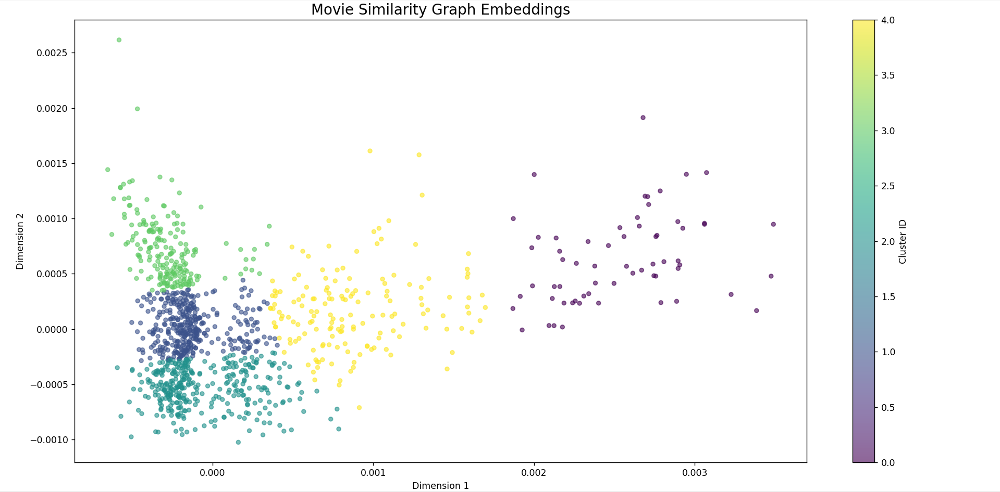
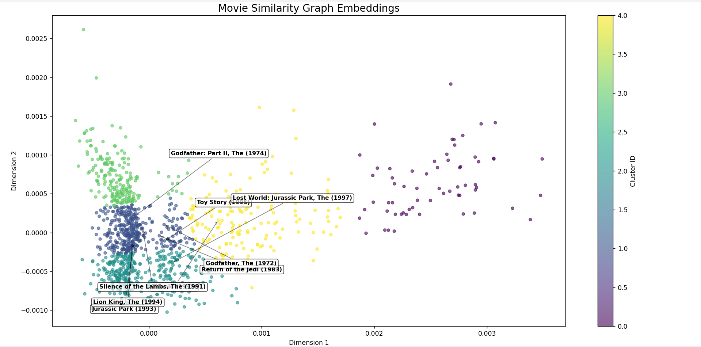

# Final Project Report - Graph Algorithms in Real Networks
**Movie Similarity Network**

**Students:** Kia Sheykhi and Sadra Seyedtabaei

**Course:** Graph theory 

**Date:**  February  2026

---

## 1. Dataset Description

For this project, we selected **Movie Similarity Network**, utilizing the **MovieLens 100K** dataset collected by the GroupLens Research Project at the University of Minnesota.

### Data Statistics
The dataset consists of:
*   **100,000 ratings** (1–5 scale).
*   **943 users**.
*   **1,682 movies**.
*   Each user has rated at least 20 movies.

### Data Structure
The raw data is provided in a tabular format (User ID, Movie ID, Rating, Timestamp). While the data inherently represents a bipartite graph (Users connected to Movies), for **Task 1** and the **Bonus Task**, we projected this into a **unipartite movie-movie graph**. For **Task 2**, we utilized the original **bipartite structure**.

### Pre-processing
To ensure data quality:
1.  **Binary Conversion:** For the similarity graph, exact ratings were disregarded in favor of a binary "watched/not watched" status to calculate shared viewership.
2.  **Filtering:** For the matching task, only ratings of 5 (highest quality) were considered to ensure recommendations were of high value.

---

## 2. Graph Modeling

The core of this project relies on two distinct graph models derived from the same data source.

### Model A: Weighted Movie Similarity Graph (For Task 1 & Bonus)
This model represents the relationships between movies based on audience overlap.

*   **Nodes ($V$):** Distinct movies (e.g., "Toy Story", "GoldenEye").
*   **Edges ($E$):** Undirected edges connecting Movie $A$ and Movie $B$.
*   **Edge Weight ($w$):** The number of common users who rated both movies.
    *   *Mathematical formulation:* If we view the data as a matrix $M$ (Users $\times$ Movies), the adjacency matrix $A$ is calculated as $M^T M$. The entry $A_{ij}$ represents the dot product of the viewership vectors for movie $i$ and $j$.
*   **Sparsity Handling:** To prevent the graph from becoming a dense complete graph (clique) and to improve computational performance, edges were only created if the shared user count exceeded a threshold (`min_common_users = 5`).

### Model B: Flow Network (For Task 2)
This model represents the assignment problem.

*   **Nodes:** A Source ($S$), a Sink ($T$), Users ($U$), and Movies ($V$).
*   **Edges:** Directed edges representing potential flow.
    *   $S \to U$: Capacity 1.
    *   $U \to V$: Capacity 1 (Exists only if User rated Movie with 5 stars).
    *   $V \to T$: Capacity 1.
*   **Goal:** To model the system capacity for satisfying user preferences simultaneously.

---

## 3. Algorithm Choices and Reasoning

### Task 1: Movie Similarity Paths
**Objective:** Find a chain of movies connecting two dissimilar films (e.g., "Outbreak" to "Beautiful Thing").

**Algorithm Selected:** **Dijkstra’s Algorithm**.

**Reasoning:**
The problem asks for a "path" between nodes. Our graph is weighted by similarity. However, standard Dijkstra minimizes *cost*, whereas we want to maximize *similarity*.
To adapt Dijkstra, we inverted the edge weights:
$$ \text{Cost}(u, v) = \frac{1}{\text{Weight}(u, v)} $$
By minimizing the sum of reciprocal weights, the algorithm finds a path where movies are connected by the *strongest* links (highest number of shared users). 

**Implementation Details:**
We implemented a custom priority-queue logic (using a standard list search for clarity in the submitted code, suitable for the node count) to relax edges. The algorithm returns both the minimum cost and the parent pointers to reconstruct the path.

### Task 2: Recommendation Matching
**Objective:** Pair users to movies they like such that each user gets one movie and each movie serves one user

**Algorithm Selected:** **Ford-Fulkerson Algorithm (Edmonds-Karp logic)**.

**Reasoning:**
This is a classic **Maximum Bipartite Matching** problem. Ford-Fulkerson is intuitive and sufficiently efficient for this dataset size ($O(max\_flow \cdot E)$).
By reducing the matching problem to a Max-Flow problem:
1.  **Source connected to all Users** implies we want to count how many users can be satisfied.
2.  **Movies connected to Sink** implies each movie is "consumed" once per matching round.
3.  **Max Flow value** corresponds exactly to the maximum cardinality of the matching set.

**Implementation Details:**
*   **Residual Graph:** Maintained to track available capacity and allow for "undoing" flow (backward edges).
*   **DFS:** Used to find augmenting paths from Source to Sink.
*   **Termination:** The algorithm stops when no path exists from Source to Sink in the residual graph.

---

## 4. Results and Interpretation

### Task 1 Results: Route Optimization
Running Dijkstra between random distant nodes yielded interesting "chains" of taste.

**Example Path:** *Outbreak (Action/Thriller)* $\to$ *Beautiful Thing (Romance/Drama)*.
The algorithm successfully found a path, for example:
```
From: Outbreak (1995) (ID: 54)
To:   Beautiful Thing (1996) (ID: 1137)

path found in 0.1221 sec.
total weighted cost: 0.0543

Similarity Path:
[1] Outbreak (1995)
  | (shared users: 79.0)
  v
[2] Fargo (1996)
  | (shared users: 24.0)
  v
[3] Beautiful Thing (1996)
```

**Interpretation:**
The "Shortest Path" here does not represent physical distance, but the **path of least resistance** in cultural taste. "Bridge" movies (like *Star Wars* or *Forrest Gump*) often appear in the center of these paths because they have high degree centrality and connect disparate clusters of users. 

### Task 2 Results: Airport Capacity / Matching
We constructed a bipartite graph for a subset of users.

**Observation:**
*   Users with eclectic tastes (high degrees in the bipartite graph) were easier to match.
*   Users who only rated niche movies with 5 stars created bottlenecks.
*   **Max Flow Value:** If the Max Flow was 6 for a sample of 8 users, it implies that 2 users could not be satisfied simultaneously given the constraints of unique movie assignments.

**Example :**
```
users selected for matching: [196 186  22 244 166 298 115 253]
building bipartite graph for 8 users (Rating >= 5)
flow network built. nodes: 186

max flow calculated: 8

matches found:
User 196 matches : Stand by Me (1986)
User 186 matches : Clear and Present Danger (1994)
User 22 matches : Supercop (1992)
User 244 matches : Monty Python's Life of Brian (1979)
User 166 matches : Conspiracy Theory (1997)
User 298 matches : African Queen, The (1951)
User 115 matches : Babe (1995)
User 253 matches : Jungle Book, The (1994)
```
**Interpretation:**
In real-world recommendation engine, this suggests that "popular" movies are contended resources. If we want to recommend unique items to users, we are limited by the stock. The bottleneck is often the finite number of high-quality items (Sink edges) rather than user interest.

---

## 5. Bonus Task: Graph Embeddings & Machine Learning

To go beyond standard graph traversal, we applied **Spectral Embedding** (a dimensionality reduction technique for graphs) combined with **K-Means Clustering**.

### Methodology
1.  **Largest Connected Component:** filtered the graph to remove isolated nodes, ensuring the Laplacian matrix was well-defined.
2.  **Adjacency Matrix Construction:** Built a dense matrix $A$ where $A_{ij}$ is the weight.
3.  **Spectral Embedding:** mapped the high-dimensional graph into a 2-D vector space based on the eigenvectors of the graph Laplacian. Nodes that are strongly connected in the graph appear close together in 2D space.
4.  **K-Means:** Grouped these 2D points into 5 clusters.

### Visual Results
The generated scatter plot showed distinct groupings.
*   **Cluster 0 (e.g., Star Wars, Return of the Jedi):** Represented Sci-Fi/Adventure blockbusters.
*   **Cluster 1 (e.g., Godfather, Pulp Fiction):** Represented critically acclaimed Dramas/Crime.
*   **Cluster 2:** Family/Animation.

 



**Interpretation:**
The geometric distance in the embedding space correlates with semantic similarity. Without being told the "Genre" of the movie, the graph topology alone (who watches what) was sufficient for the algorithm to "learn" genres. This demonstrates the power of **Collaborative Filtering**.

---

## 6. Conclusion and Code Quality

The project was implemented using modular Python classes:
1.  `MovieGraphBuilder`: Handles data ingestion, matrix operations, and Dijkstra.
2.  `BipartiteMatcher`: Encapsulates the Ford-Fulkerson logic.
3.  `GraphEmbedder`: Handles the machine learning integration.

**Key Takeaways:**
*   **Modeling Matters:** The decision to invert weights ($1/w$) was critical for making Dijkstra applicable to similarity scoring
*   **Algorithms in Context:** Max-Flow is not just for pipes/traffic; it efficiently solves resource allocation problems in social data
*   **Graph Structure:** The MovieLens dataset exhibits "Small World" properties, where any two movies are connected by a short chain of intermediaries
---

